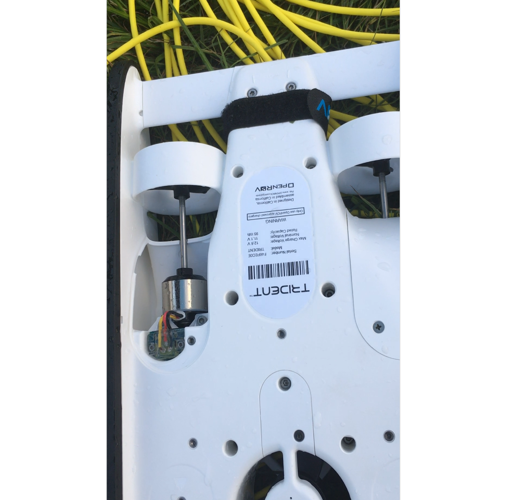

class: left, bottom, inverse

background-image: url("/myndir/klettur.jpeg")
background-size: contain
# Nutum náttúrunnar 
---

class: center, inverse
background-image: url("/myndir/krabbi.jpeg")
background-size: contain
#Fundum vísbendingu um grjótkrabba 
###(einn slíkur kom í gildru stuttu seinna [`r anicon::faa('external-link-alt', animate='float', rtext='BioPol.is')`](https://biopol.is/frettir/grj%C3%B3tkrabbi_%C3%A1_skagastr%C3%B6nd))

---
class: left, inverse
background-image: url("/myndir/taekid.jpeg")
background-size: contain
# .pull-left[.litur[Tækið barst með haustinu `r anicon::faa('leaf', animate='spin', speed="slow")`]]
---
class: right, inverse
# Svo varð eitthvert djöfulsins `r anicon::faa("grunt", animate='ring')` bilerí `r anicon::cia("party_parrot.gif", size=3, border=T)`
```{r echo=FALSE, message=FALSE, warning=FALSE, out.width='50%'}

```

---


class: center, inverse
background-image: url("/myndir/styra.jpeg")
background-size: contain
# .pull-left[.litur[Prufukeyrsla með græjuna `r anicon::faa("gamepad", animate='ring')`]]

---

class: bottom, inverse
background-image: url("/myndir/thari.png")
background-size: contain
# .pull-left[.litur[Þá gátu rannsóknir hafist `r anicon::cia("myndir/aw_yeah.gif")`]]

